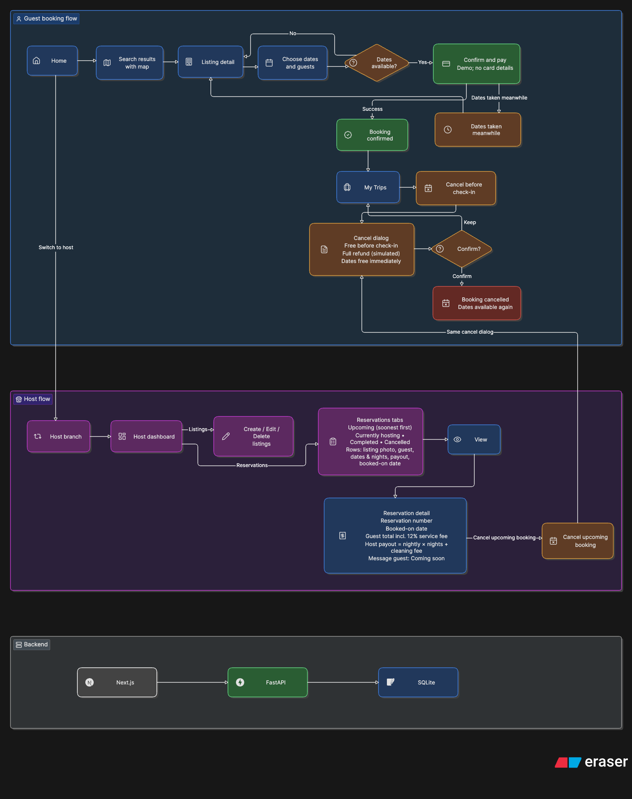
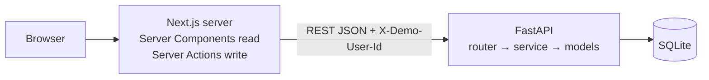
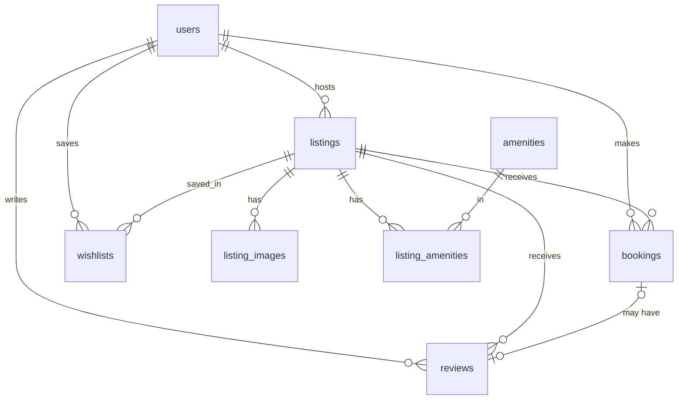

# Stays — an Airbnb-style booking marketplace

A full-stack Airbnb clone: browse and search stays, check availability, book with a mocked
checkout, manage trips and wishlists, review completed stays, and run listings as a host — in a
light or dark theme.

| | |
|---|---|
| **Live demo** | https://stays-demo.vercel.app |
| **API docs (Swagger)** | https://airbnb-clone-assignment-api.onrender.com/docs |
| **Stack** | Next.js 16 + TypeScript · FastAPI (Python) · SQLite + SQLAlchemy 2 |

> The free backend sleeps after 15 idle minutes; the first request can take ~1 minute.
> Designed for desktop screens (1280px and wider).

---

## Quick tour

1. **Home** — category tabs, search bar (folds into a compact pill on scroll), photo-card carousels.
2. **Search** — Where `Goa`, any dates, 2 guests → list + interactive map with price pins
   (hover a card to highlight its pin; click a pin for a preview). Try **Filters** and pagination.
3. **Listing** — gallery, amenities, host, reviews, availability calendar (booked nights are
   struck through), live price breakdown → **Reserve**.
4. **Checkout** — demo "Confirm and pay" (no card data) → confirmation → **Trips** shows it;
   those dates are now blocked for everyone.
5. **Host** — menu → switch to a host (e.g. Vikram Rao) → **Host dashboard** → create, edit or
   delete a listing; reservations have tabs (Upcoming, Currently hosting, Completed, Cancelled) →
   **View** shows the guest's price breakdown, your payout and a **Cancel** option.
6. **Review a stay** — as the default guest (Priya Nair) open **Trips** → a past stay marked
   **Leave a review** → pick 1–5 stars and write a comment → **Publish review**. The review
   appears on the listing and counts toward its rating; the host sees it on the reservation.
7. **Dark mode** — the moon/sun button in the header switches theme. The choice is remembered
   (and follows the system setting until you pick one), with no flash of the wrong theme on load.

---

## Requirements coverage

| Assignment requirement | Where to look |
|---|---|
| Listing grid (photo, title, location, price, rating) | `components/listing/ListingCard.tsx` |
| Search: location + date range + guests | `components/search/SearchBar.tsx` |
| Category / filter row (price, type, amenities) | `CategoryBar.tsx`, `FiltersModal.tsx` |
| Pagination | `components/explore/Pagination.tsx` |
| Detail: gallery, description, location, amenities, host, reviews | `components/listing-detail/` |
| Availability calendar + price breakdown (nightly × nights + fees) | `AvailabilityCalendar.tsx`, `bookings/pricing.py` |
| Booking with validation, no overlapping dates | `bookings/service.py` + SQLite triggers |
| Mocked checkout, confirmation, **My Trips** | `app/listings/[id]/book`, `app/trips` |
| Bookings persist and block dates | `bookings` table, `/listings/{id}/availability` |
| Host CRUD + dashboard with bookings | `app/host`, `backend/app/host` |
| Host reservation detail: payout, guest total, cancel | `app/trips/[bookingId]` (host view) |
| Toasts, modals, date pickers, wishlist | `ui/Toast.tsx`, `FiltersModal.tsx`, `RangeCalendar.tsx` |
| Guest vs host (mocked auth) | header menu → *Switch demo user* |
| Seeded data (listings, hosts, bookings, reviews) | `backend/app/seed` |
| Mocked: payments, messaging, ID verification | "Coming soon" / demo labels |
| **Bonus:** interactive map with pins | `ListingGrid.tsx` (OpenStreetMap tiles) |
| **Bonus:** Superhost badges, rating aggregation | listing cards, reviews summary |
| **Bonus:** leave a review after a completed stay | `backend/app/reviews`, `components/trips/ReviewForm.tsx` |
| **Bonus:** dark mode (header toggle, remembered, no flash) | `components/layout/ThemeToggle.tsx`, `lib/theme.ts`, `globals.css` |

---

## How it works

### User flow



### Architecture



- **Frontend** (`frontend/src`): `app/` holds thin route files; `components/` is grouped by
  feature (`search`, `listing`, `listing-detail`, `trips`, `host`, `layout`, `ui`); `lib/api/` is
  a typed client per feature. Pages read data on the server; all writes go through Server
  Actions (`app/actions.ts`), so the browser never calls the API directly. Search state lives in
  the URL, so every view is linkable and the back button works.
- **Backend** (`backend/app`): one folder per feature (`listings`, `bookings`, `reviews`, `host`,
  `wishlists`, `users`, `meta`), each with `router.py` (HTTP only), `schemas.py` (Pydantic
  request/response) and `service.py` (business rules). Errors share one shape:
  `{"error": {"code", "message", "details"}}`.
- **Rules live on the server**: prices are always computed by the backend, and overlaps are
  blocked twice — inside a `BEGIN IMMEDIATE` transaction and by database triggers.
- **Theming**: colours are CSS variables in `globals.css`, redefined under
  `:root[data-theme="dark"]`. A tiny inline script in `app/layout.tsx` applies the saved theme
  (browser `localStorage`) before the first paint; `ThemeToggle` switches it.

---

## Database schema



| Table | Purpose and key constraints |
|---|---|
| `users` | Guests and hosts (`is_host`, `is_superhost`); unique email |
| `listings` | Property data, location (lat/lng), `nightly_price`, `cleaning_fee`, capacity; CHECKs on price/guests; soft delete (`deleted_at`) |
| `listing_images` | Ordered photos; `UNIQUE(listing_id, position)`, position 0 = cover |
| `amenities` / `listing_amenities` | Amenity catalogue + many-to-many link (composite PK) |
| `bookings` | `check_in`, `check_out`, guests, status, **price snapshot** (nights, subtotal, fees, total); CHECK `check_out > check_in`; overlap triggers; index on `(listing_id, status, check_in, check_out)` |
| `reviews` | Rating 1–5 + comment; optional link to a booking, `UNIQUE(booking_id)` so a stay is reviewed at most once |
| `wishlists` | `(user_id, listing_id)` composite PK, so saving is idempotent |

**Booking rules:** a stay is `[check_in, check_out)` — check-out day is free for the next guest.
Two stays overlap when `a.check_in < b.check_out AND b.check_in < a.check_out` → **409
`DATES_UNAVAILABLE`**. No past check-ins, 1–90 nights, guests ≤ capacity, hosts can't book their
own listing. Price = nightly × nights + cleaning fee + 12% service fee (demo); the host payout is
nightly × nights + cleaning fee. The guest or the host can cancel before check-in (full simulated
refund) and the dates free immediately. Money is stored as integer paise.

**Review rules:** only the booking's guest can review, only a confirmed stay whose check-out
date has passed (check-out day counts), once per booking, and not after the host removed the
listing. Comments are 10–1,000 characters. Violations return `409` (`STAY_NOT_COMPLETED`,
`BOOKING_CANCELLED`, `ALREADY_REVIEWED`, `LISTING_REMOVED`), `403 NOT_GUEST` for the host, or
`404` for anyone else.

---

## API overview (`/api/v1`)

Signed-in routes take the mock header `X-Demo-User-Id: <id>`. Full schema at `/docs`.

| Method | Path | Purpose |
|---|---|---|
| GET | `/listings` | Search: `location`, `check_in`, `check_out`, `guests`, `min_price`, `max_price`, `property_type`, `room_type`, `category`, `amenities`, `min_bedrooms`, `page`, `page_size` |
| GET | `/listings/{id}` | Detail: images, amenities, host, rating summary, reviews |
| GET | `/listings/{id}/availability` | Booked date ranges |
| GET | `/listings/{id}/quote` | Validated price breakdown for dates + guests |
| POST | `/bookings` | Create booking `{listing_id, check_in, check_out, guests}` |
| GET / POST | `/bookings/{id}`, `/bookings/{id}/cancel` | View / cancel a booking (its guest or the listing's host, before check-in) |
| POST | `/bookings/{id}/review` | Review a completed stay `{rating 1–5, comment}`: the booking's guest only, after check-out, once per booking (409 `ALREADY_REVIEWED` / `STAY_NOT_COMPLETED`) |
| GET | `/me`, `/me/trips` | Current user and their trips |
| GET / PUT / DELETE | `/me/wishlist[/{listing_id}]` | Wishlist |
| GET / POST / PUT / DELETE | `/host/listings[/{id}]` | Host listing CRUD (owner only) |
| GET | `/host/bookings` | Reservations on the host's listings |
| GET | `/users/demo`, `/meta/amenities`, `/health` | Demo users, amenity list, health check |

---

## Run it locally

Needs **Node.js 20.9+** and **Python 3.11+**.

```bash
# 1) Backend → http://localhost:8000  (docs at /docs)
cd backend
python3 -m venv .venv && source .venv/bin/activate
pip install -r requirements.txt
uvicorn app.main:app --reload --port 8000

# 2) Frontend → http://localhost:3000  (new terminal)
cd frontend
npm install
npm run dev
```

The database (`backend/data/app.db`) is created and seeded automatically on first start:
**32 listings, 5 hosts, 8 guests, 22 amenities, ~180 reviews, 20 bookings** (two completed stays are left unreviewed so a review can be tried right away).

| Task | Command |
|---|---|
| Reset demo data | `cd backend && python -m app.seed --reset` |
| Backend tests (32) | `cd backend && pip install -r requirements-dev.txt && python -m pytest` |
| Frontend checks | `cd frontend && npm run lint && npx tsc --noEmit && npm run build` |

Environment variables are optional locally; see `backend/.env.example` and
`frontend/.env.example` (`DATABASE_URL`, `CORS_ORIGINS`, `NEXT_PUBLIC_API_BASE_URL`, …).

---

## Assumptions and mocks

- **Sign-in is mocked:** pick any seeded user from the header menu; hosts get the host tools.
- **Payments are mocked:** checkout is clearly labelled as a demo and never asks for card details.
- **Messaging, identity verification, Experiences and Services** show "Coming soon" /
  "not available yet".
- **Photos** are image URLs (Unsplash); there is no file upload. The map uses free
  OpenStreetMap tiles. Prices are in INR.
- Category tab icons (`frontend/public/icons`) are reference images supplied for visual matching.
- **Theme preference** is stored per browser (`localStorage`), not per demo user.

## Deployment

- **Frontend:** Vercel project `stays-demo` (root `frontend/`), deployed with the Vercel CLI
  (`vercel deploy --prod`); it is not linked to Git, so pushes don't redeploy it.
- **Backend:** Render free tier via `render.yaml` (root `backend/`), auto-deployed on every push
  to `main`. The free tier has no persistent disk, so the database resets to seed data after a
  deploy, restart or sleep.

## Known limitations

- Demo data on the hosted backend is not permanent (free tier, see above).
- Desktop-only layout; search is ordered by listing id.
- Reviews can't be edited or deleted once published; review dates display the UTC calendar day.
